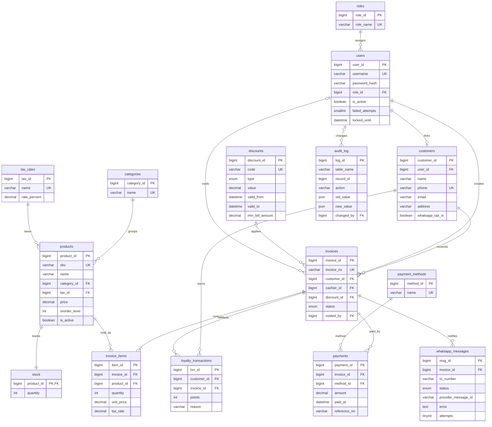

# Billing database ER diagram

```mermaid
erDiagram
  roles ||--o{ users : assigns
  users ||--o| customers : links
  categories ||--o{ products : groups
  tax_rates ||--o{ products : taxes
  products ||--|| stock : tracks
  customers ||--o{ invoices : receives
  users ||--o{ invoices : creates
  discounts o|--o{ invoices : applies
  users o|--o{ invoices : voids
  invoices ||--|{ invoice_items : contains
  products ||--o{ invoice_items : sold_as
  invoices ||--o{ payments : paid_by
  payment_methods ||--o{ payments : method
  customers ||--o{ loyalty_transactions : earns
  invoices ||--o{ loyalty_transactions : rewards
  invoices ||--o{ whatsapp_messages : notifies
  users o|--o{ audit_log : changes

  roles {
    bigint role_id PK
    varchar role_name UK
  }
  users {
    bigint user_id PK
    varchar username UK
    varchar password_hash
    bigint role_id FK
    boolean is_active
    smallint failed_attempts
    datetime locked_until
  }
  customers {
    bigint customer_id PK
    bigint user_id FK
    varchar name
    varchar phone UK
    varchar email
    varchar address
    boolean whatsapp_opt_in
  }
  categories {
    bigint category_id PK
    varchar name UK
  }
  tax_rates {
    bigint tax_id PK
    varchar name UK
    decimal rate_percent
  }
  products {
    bigint product_id PK
    varchar sku UK
    varchar name
    bigint category_id FK
    bigint tax_id FK
    decimal price
    int reorder_level
    boolean is_active
  }
  stock {
    bigint product_id PK, FK
    int quantity
  }
  discounts {
    bigint discount_id PK
    varchar code UK
    enum type
    decimal value
    datetime valid_from
    datetime valid_to
    decimal min_bill_amount
  }
  payment_methods {
    bigint method_id PK
    varchar name UK
  }
  invoices {
    bigint invoice_id PK
    varchar invoice_no UK
    bigint customer_id FK
    bigint cashier_id FK
    bigint discount_id FK
    enum status
    bigint voided_by FK
  }
  invoice_items {
    bigint item_id PK
    bigint invoice_id FK
    bigint product_id FK
    int quantity
    decimal unit_price
    decimal tax_rate
  }
  payments {
    bigint payment_id PK
    bigint invoice_id FK
    bigint method_id FK
    decimal amount
    datetime paid_at
    varchar reference_no
  }
  loyalty_transactions {
    bigint txn_id PK
    bigint customer_id FK
    bigint invoice_id FK
    int points
    varchar reason
  }
  whatsapp_messages {
    bigint msg_id PK
    bigint invoice_id FK
    varchar to_number
    enum status
    varchar provider_message_id
    text error
    tinyint attempts
  }
  audit_log {
    bigint log_id PK
    varchar table_name
    bigint record_id
    varchar action
    json old_value
    json new_value
    bigint changed_by FK
  }
```
